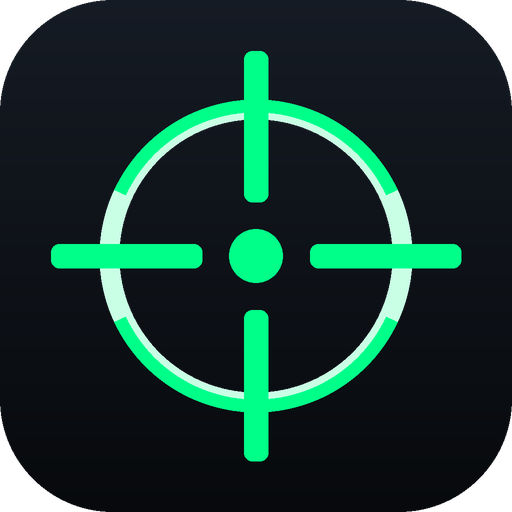
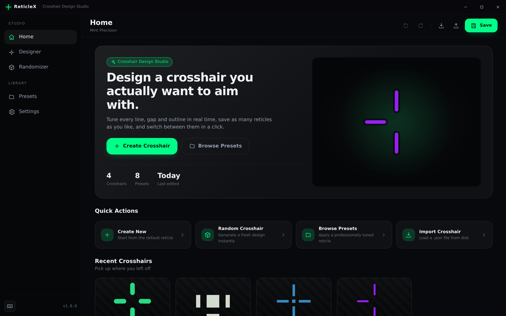
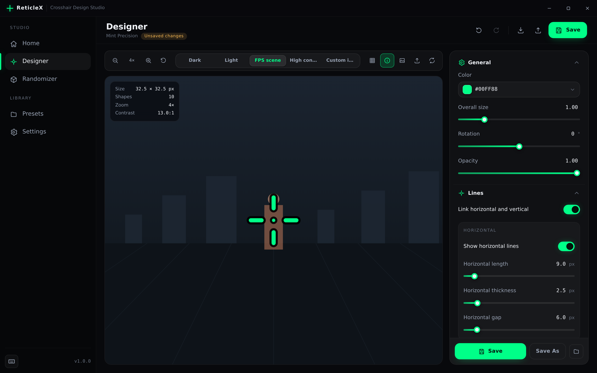
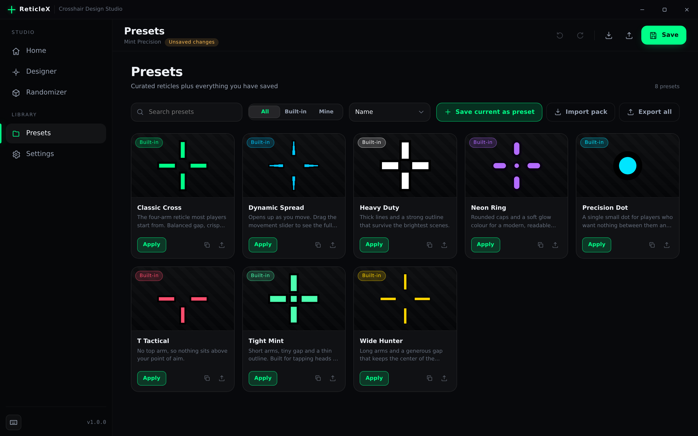
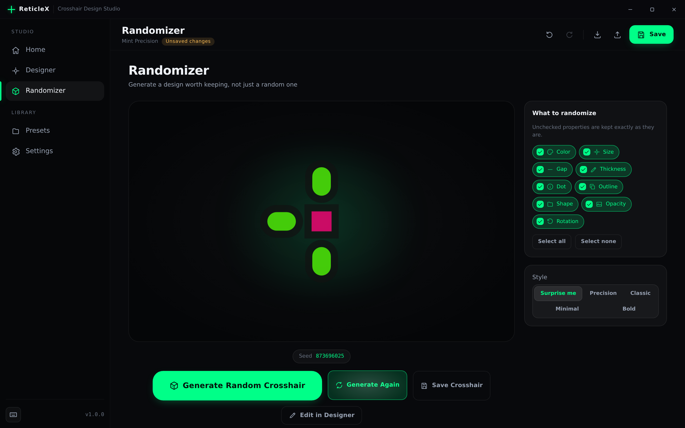
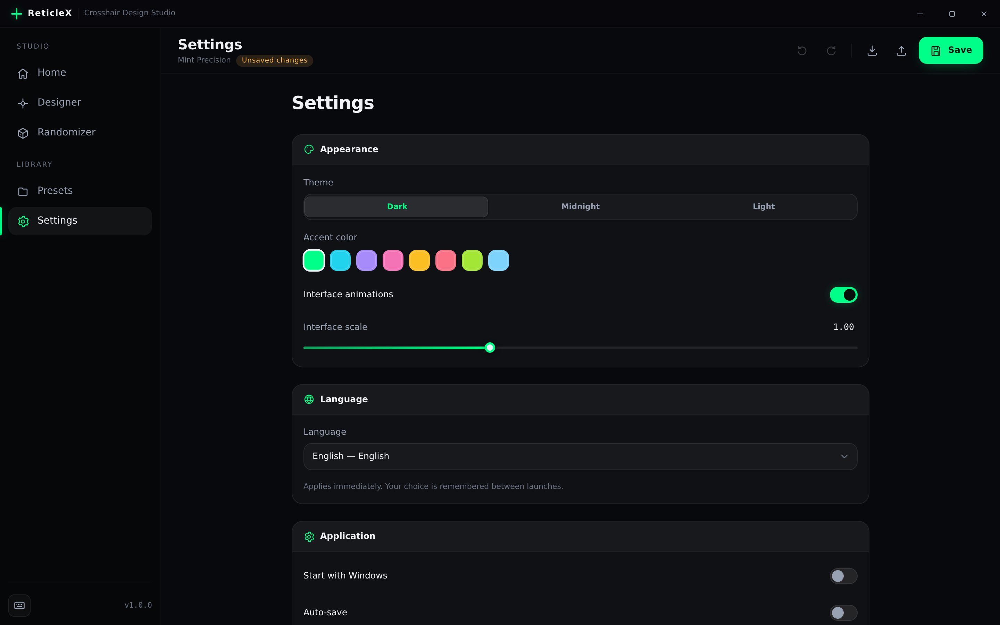
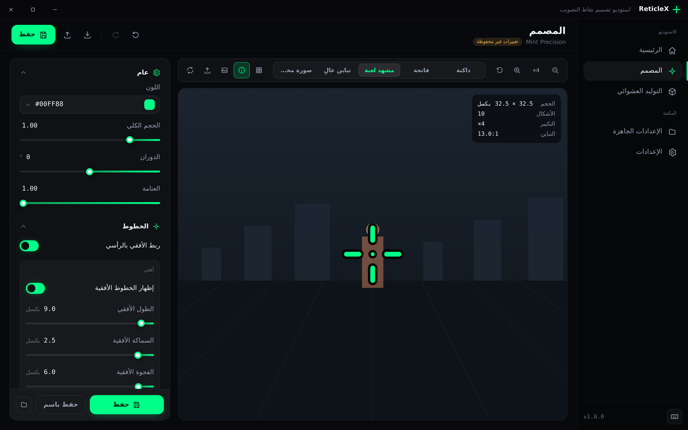

<div align="center">



# ReticleX

**A crosshair design studio for Windows.**

Tune every line, gap and outline in real time, keep a library of reticles,
and switch between them in a click.

[](https://github.com/quantum3ap/reticlex/actions/workflows/ci.yml)
[](https://github.com/quantum3ap/reticlex/actions/workflows/release.yml)
[](LICENSE)

[Download](#installation) · [Features](#features) · [Building](#building-from-source) · [Architecture](#architecture)

</div>

---

## Overview

ReticleX is a standalone design tool. You draw a crosshair, you look at it
against a background of your choosing, and you save it. It does not attach to,
read from, or modify any game — it is a drawing program whose subject happens
to be reticles, and everything it produces is a JSON file and a PNG.

The interesting part is underneath. Crosshair geometry, rasterisation,
validation and the randomizer live in one C and C++ core that is compiled
twice: as a native DLL the Windows host loads, and as a freestanding
WebAssembly module the interface loads. Both builds resolve identical geometry
from identical input, which a set of golden fixtures asserts on every commit.
There is no second implementation to drift.

## Features

### Designer

A live preview beside every control. Adjust and the reticle updates in the
same frame.

- Horizontal and vertical length, thickness and gap, independently or linked
- Overall scale, rotation and opacity
- Per-arm visibility, the classic T shape, and flat, round or tapered ends
- Outline with its own thickness, opacity and colour
- Centre dot: square or round, its own size, opacity and colour
- Dynamic behaviour that opens the reticle up as you move
- A colour picker with HEX, RGB and HSL, a saturation plane and swatches

### Preview

- Zoom from 1× to 24×, by button or Ctrl + scroll
- Dark, light, high-contrast and a drawn FPS scene, or your own image
- Optional pixel grid and a live read-out of size, shape count and the WCAG
  contrast ratio against the current background

### Library

- Save, rename, duplicate and delete, with auto-save for work in progress
- Recent crosshairs on the home page, each with a rendered thumbnail
- Eight built-in presets, plus anything you promote to a preset of your own
- Search, filter and sort across the whole preset library

### Randomizer

Generates designs biased towards one of five style archetypes rather than
sampling every slider uniformly, so results are usable rather than merely
random. Choose which properties are in play, keep the rest, and reroll. Every
result carries a seed you can copy and reproduce exactly.

### Everything else

- Full undo and redo, with a slider drag collapsing into one step
- Import and export as JSON, with clear errors for anything malformed
- Ten languages including Arabic with a fully mirrored right-to-left layout
- Themes, accent colours, interface scale, and an animation switch
- Keyboard shortcuts throughout, listed in Settings and in a dialog

## Screenshots

| | |
|---|---|
|  |  |
| **Home** — recent crosshairs and quick actions | **Designer** — live preview and every control |
|  |  |
| **Presets** — built-in and custom reticles | **Randomizer** — style-biased generation |
|  |  |
| **Settings** — appearance, language, data | **Arabic** — full right-to-left layout |

## Supported languages

| | | | | |
|---|---|---|---|---|
| English | العربية (RTL) | Español | Français | Deutsch |
| Português | Türkçe | Русский | 简体中文 | 日本語 |

Every string in the interface comes from `localization/*.json`; nothing is
hard-coded. All ten catalogues carry the same 356 keys, and a test fails the
build if one falls behind or a placeholder stops matching. Selecting Arabic
mirrors the layout without a restart. On first launch ReticleX follows the
Windows display language when it has a catalogue for it, and English otherwise.

Adding a language is one file:

1. Copy `localization/en.json` to `localization/<code>.json` and translate the
   values.
2. Add the code to `LOCALES` in `frontend/js/core/i18n.js` and to
   `SupportedLocales` in `desktop/csharp/ReticleX.Core/Services/LocalizationCatalog.cs`.

## Installation

Grab the latest build from [**Releases**](https://github.com/quantum3ap/reticlex/releases).

| Download | Use it when |
|---|---|
| `ReticleX-v<version>-Setup.exe` | You want it installed. Per user, no administrator prompt, Start menu entry. |
| `ReticleX-v<version>-Portable.exe` | You want to run it from anywhere, including a USB stick. |
| `ReticleX-v<version>-Portable.zip` | The portable build with its content folder, for offline machines. |

**Requirements.** Windows 10 version 1809 or newer, 64-bit, and the Microsoft
Edge WebView2 runtime. WebView2 already ships with Windows 11 and with
up-to-date Windows 10; the installer offers to fetch it if it is missing.

Your crosshairs, presets and settings live in `%APPDATA%\ReticleX`. ReticleX
never writes outside your own profile and never asks for administrator rights.

## Building from source

### What you need

| Tool | For | Notes |
|---|---|---|
| CMake 3.20+ and a C/C++ compiler | The native core | MSVC on Windows, GCC or Clang elsewhere |
| .NET SDK 8.0 | The desktop host | |
| Node.js 20+ | The front-end tests | No npm dependencies to install |
| Clang 15+ with `wasm-ld` | The WebAssembly module | Only when changing the core |
| Inno Setup 6 | The installer | Only when packaging |

### Windows

```powershell
git clone https://github.com/quantum3ap/reticlex.git
cd reticlex

pwsh scripts/build-native.ps1          # reticlex_core.dll, plus the core tests
dotnet build desktop/csharp/ReticleX.sln -c Release
dotnet run --project desktop/csharp/ReticleX.App
```

To produce the release executables:

```powershell
pwsh scripts/package.ps1 -Version 1.0.0
# build/artifacts/ReticleX-v1.0.0-Setup.exe
# build/artifacts/ReticleX-v1.0.0-Portable.exe
```

### Linux and macOS

The desktop shell is Windows-only, but the core and the interface are not.

```bash
./scripts/build-core.sh                # build, test, regenerate fixtures and wasm
node scripts/dev-server.js             # then open http://localhost:4173/
```

Opened this way the interface runs against the same WebAssembly core and
stores its data in `localStorage`, so every screen is usable without the host.
This is how the front end is developed and tested.

### Running the tests

```bash
./scripts/build-core.sh                                  # 70 core tests
cd frontend && node --test "tests/*.test.js"             # 109 front-end tests
dotnet test desktop/csharp/ReticleX.Tests \
  -p:ReticleXNativeLibrary=$PWD/build/core/libreticlex_core.so   # 137 managed tests
```

What they cover: crosshair geometry and rasterisation, colour conversion, the
randomizer's reproducibility and output quality, configuration validation and
repair, JSON import and export against adversarial input, undo and redo,
settings persistence, the storage layer's behaviour with corrupt files,
translation completeness across all ten languages, and the ABI agreement
between the C struct, the managed struct and the WebAssembly module.

### Cutting a release

```bash
git tag v1.0.0
git push origin v1.0.0
```

The [release workflow](.github/workflows/release.yml) then builds and tests the
core on Linux, rebuilds the WebAssembly module, runs every test suite, builds
the native DLL and the desktop application on Windows, packages the installer
and the portable build, and attaches both executables to the GitHub release.

## Architecture

Four layers, each doing what it is genuinely best at.

```
┌──────────────────────────────────────────────────────────────────────┐
│  Front end — HTML, CSS, JavaScript                    frontend/      │
│  Five pages, custom controls, canvas preview, undo/redo, i18n.       │
│  Loads the core as WebAssembly and draws its geometry directly.      │
└───────────────┬──────────────────────────────────────────────────────┘
                │  WebView2 message bridge (JSON request/response)
┌───────────────┴──────────────────────────────────────────────────────┐
│  Desktop host — C#, WPF + WebView2                    desktop/csharp/│
│  Window chrome, file dialogs, per-user storage, PNG thumbnails,      │
│  start-with-Windows, single instance, crash logging.                 │
└───────────────┬──────────────────────────────────────────────────────┘
                │  P/Invoke (flat struct, no marshalling)
┌───────────────┴──────────────────────────────────────────────────────┐
│  Core — C++                                           core/cpp/      │
│  Configuration ABI, geometry builder, SDF rasteriser, randomizer.    │
│  Compiled to reticlex_core.dll and to reticlex_core.wasm.            │
└───────────────┬──────────────────────────────────────────────────────┘
                │
┌───────────────┴──────────────────────────────────────────────────────┐
│  Primitives — C                                       core/c/        │
│  Freestanding maths, xoshiro128++ PRNG, colour science, FNV-1a.      │
└──────────────────────────────────────────────────────────────────────┘
```

**Why each language is there.**

- **C** — the WebAssembly build is freestanding and has no libm, so the core
  carries its own `sin`, `cos`, `sqrt`, `exp` and `log`. Hand-writing them also
  makes results bit-reproducible across MSVC, GCC and Clang, which is what lets
  one build's output be asserted against another's. Alongside them sit a
  seedable PRNG (so a generated crosshair can be shared as a seed and
  regenerated exactly), colour-space conversion, and hashing.
- **C++** — the geometry builder, the anti-aliased signed-distance-field
  rasteriser and the aesthetic randomizer. Enough structure to be readable,
  no allocation, no exceptions, reentrant.
- **C#** — everything that is genuinely a Windows problem: the window, the
  file dialogs, the registry, per-user storage with atomic writes and corrupt
  file quarantine, and PNG thumbnails rendered through the native core.
- **JavaScript, HTML, CSS** — the interface. Canvas for the preview, CSS for a
  design system that themes and mirrors itself, no framework and no
  dependencies.

**How the two core builds stay honest.** `core/tests/fixture_writer.cpp` runs
nineteen configurations through the native build and writes the resulting
geometry to `frontend/tests/fixtures/geometry-golden.json`. The front-end test
suite feeds the same configurations to the WebAssembly build and asserts every
shape matches to within 1e-4, along with the fingerprint and the field table.
CI fails if the committed fixtures are stale.

### Project structure

```
reticlex/
├── core/
│   ├── c/                    Freestanding maths, PRNG, colour, hashing
│   ├── cpp/                  Config ABI, geometry, rasteriser, randomizer
│   ├── tests/                70 tests and the golden fixture writer
│   └── CMakeLists.txt
├── desktop/csharp/
│   ├── ReticleX.Core/        Storage, serialization, interop (net8.0)
│   ├── ReticleX.App/         WPF + WebView2 shell (net8.0-windows)
│   └── ReticleX.Tests/       137 tests (net8.0)
├── frontend/
│   ├── css/                  Tokens, layout, controls, components, RTL
│   ├── js/
│   │   ├── core/             wasm loader, schema, session, i18n, storage
│   │   ├── render/           Canvas renderer and the preview surface
│   │   ├── ui/               Controls, cards, toasts, tooltips, dialogs
│   │   └── pages/            Home, Designer, Presets, Randomizer, Settings
│   ├── tests/                109 tests plus the golden fixtures
│   └── index.html
├── localization/             Ten catalogues, 356 keys each
├── presets/                  The built-in reticles
├── installer/                Inno Setup script
├── scripts/                  Build, package and generation scripts
└── .github/workflows/        CI and release
```

### The crosshair format

Exports are plain JSON, meant to be readable and hand-editable:

```json
{
  "format": "reticlex-crosshair",
  "version": 1,
  "name": "Tight Mint",
  "crosshair": {
    "scale": 1, "rotation": 0, "opacity": 1,
    "color": "#4CFFB0",
    "horizontal": { "enabled": true, "length": 4, "thickness": 1.5, "gap": 2 },
    "vertical":   { "enabled": true, "length": 4, "thickness": 1.5, "gap": 2 },
    "arms":    { "left": true, "right": true, "top": true, "bottom": true,
                 "tShape": false, "capStyle": "flat" },
    "outline": { "enabled": true, "thickness": 0.5, "opacity": 0.9, "color": "#000000" },
    "dot":     { "enabled": true, "size": 1.5, "opacity": 1,
                 "inheritColor": true, "shape": "square", "color": "#4CFFB0" },
    "dynamic": { "enabled": false, "spread": 0, "gapBoost": 8 }
  }
}
```

Missing fields fall back to their defaults, out-of-range values are clamped and
reported, and anything that is not a ReticleX crosshair is refused with a
message rather than a crash.

## Keyboard shortcuts

| Shortcut | Action |
|---|---|
| <kbd>Ctrl</kbd> + <kbd>N</kbd> | New crosshair |
| <kbd>Ctrl</kbd> + <kbd>S</kbd> | Save |
| <kbd>Ctrl</kbd> + <kbd>Shift</kbd> + <kbd>S</kbd> | Save as |
| <kbd>Ctrl</kbd> + <kbd>O</kbd> | Import |
| <kbd>Ctrl</kbd> + <kbd>E</kbd> | Export |
| <kbd>Ctrl</kbd> + <kbd>Z</kbd> | Undo |
| <kbd>Ctrl</kbd> + <kbd>Y</kbd> | Redo |
| <kbd>Ctrl</kbd> + <kbd>/</kbd> | Show shortcuts |
| <kbd>Ctrl</kbd> + scroll | Zoom the preview |

## Scope

ReticleX is a design and visualisation tool. It draws crosshairs, saves them as
JSON, and exports them as PNG. It does not read or write any other process's
memory, inject code, hook input, or interact with any game in any way. There is
nothing here to bypass anti-cheat with, and nothing that would want to.

## Contributing

Issues and pull requests are welcome. Before opening one:

- `./scripts/build-core.sh` after any change under `core/`, and commit the
  regenerated fixtures.
- `node scripts/build-presets.mjs` after changing a built-in preset.
- Never hard-code interface text; add a key to all ten catalogues.
- Keep the ABI additive. New configuration fields go at the end of the struct,
  the field table and both mirrors, and `RX_CONFIG_SCHEMA` goes up.

## License

[MIT](LICENSE).
